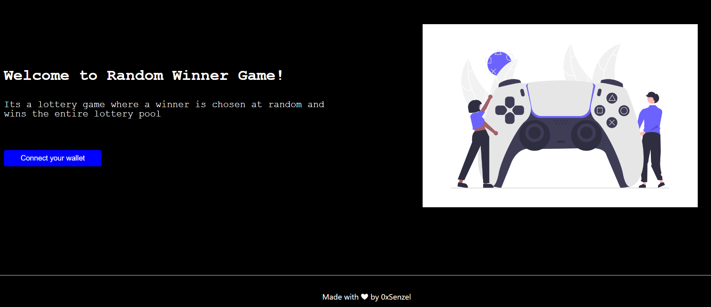
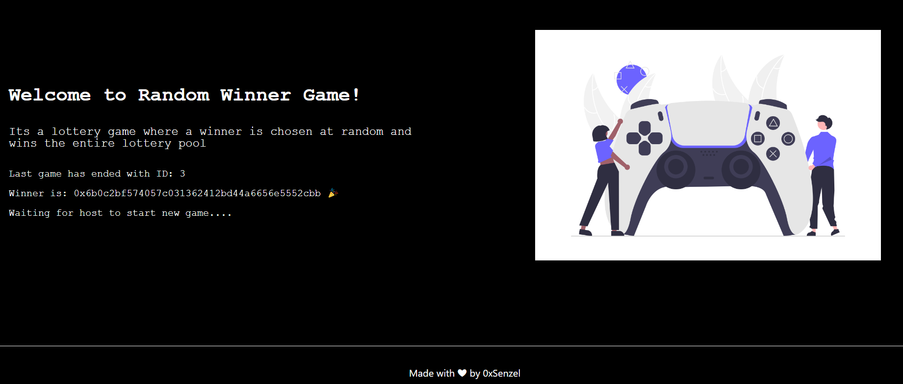
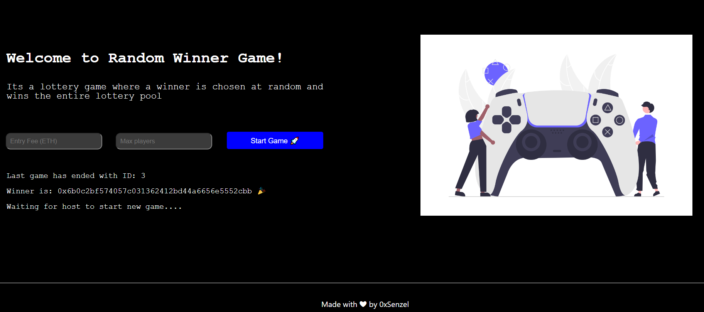
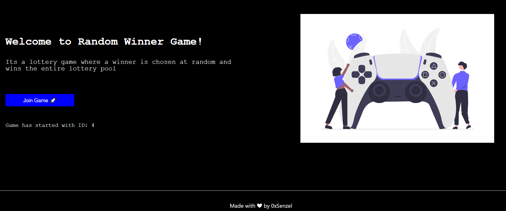
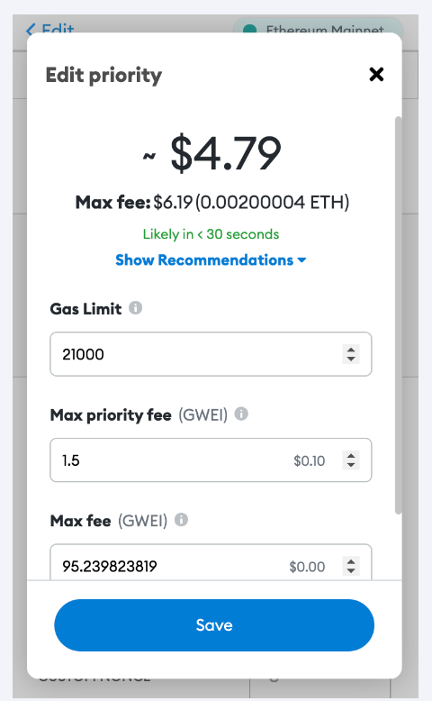

# Indexing Chainlink VRF V2 Lottery Game using The Graph's Indexer

This repo contains coursework project from [LearnWeb3](https://learnweb3.io/) completed by [0xsenzel](https://github.com/0xSenzel/) for [LearnWeb3DAO-Junior](https://learnweb3.io/courses/6394ea7c-0ad6-4a4a-879f-7f9756bc5976/lessons) lesson.

## Project Info

Randomness source from [Chainlink VRF V2](https://docs.chain.link/vrf/v2/introduction/) to pick random winner for lottery game. Log the winners using [The Graph Indexing](https://thegraph.com/docs/en/network/indexing/).

## Project Demo

<figure>

<p align="center">Fig.1 - Home Page</p>
</figure>

<br/>

<figure>

<p align="center">Fig.2 - Connected with wallet</p>
</figure>

<br/>

<figure>

<p align="center">Fig.3 - Connect with Owner's Wallet to Start Game</p>
</figure>

<br/>

<figure>

<p align="center">Fig.4 - Home Page View Once Game Started</p>
</figure>

</br>
<!-- <a style="color: red ; font-size: 25px">⭐Note</a> -->

> **Note**

Under the situation were you were unable to join, adjust your "Gas Limit" ; "Max Priority Fee" ; "Max Fee" accordingly.
Here's a [guide](https://metamask.zendesk.com/hc/en-us/articles/4402538041869-Error-ethjs-query-while-formatting-outputs-from-RPC-transaction-underpriced-error-) on how to adjust on Metamask.

<p align="center">

</p>

## Project Setup

### Hardhat

Head to [hardhat-tutorial](./hardhat-tutorial/) folder:

Install dependencies

```
npm install
```

Compile smart contract

```
npx hardhat compile
```

To deploy smart contracts: <br/>
Head to [hardhat.config.js](./hardhat-tutorial/hardhat.config.js) file, change the value of:

- `ALCHEMY_HTTP_URL` with your own Ethereum Network API
- `PRIVATE_KEY` with your Ethereum wallet's private key
- `POLYGONSCAN_API_KEY` with your Etherscan's API Key

Then run the following command.

```
npx hardhat run scripts/deploy.js --network goerli
npx hardhat verify --network mumbai YOUR_SMARTCONTRACT_ADDRESS "CONSTRUCTOR ARG1" "CONSTRUCTOR ARG2"
```

<br/>

### Subgraph

Head to [graph](./graph/) folder:

```
npm install
```

Create an [account](https://thegraph.com/hosted-service/dashboard) and [setup](https://thegraph.com/docs/en/deploying/deploying-a-subgraph-to-hosted/) your Subgraph Indexing. Here are some of the command you can use to setup locally:

```
yarn global add @graphprotocol/graph-cli
graph init --contract-name RandomWinnerGame --product hosted-service GITHUB_USERNAME/Learnweb3  --from-contract YOUR_RANDOM_WINNER_GAME_CONTRACT_ADDRESS  --abi ./abi.json --network mumbai graph
graph auth
yarn codegen
yarn deploy
```

<br/>

### React & Next Js

Head to [my-app](./my-app/) folder:

```
npm install
```

Replace the variable inside [this file](./my-app/constants/index.js):

- `RANDOM_GAME_NFT_CONTRACT_ADDRESS` with your deployed smart contract address.

Replace `SUBGRAPH_URL` located in [this file](./my-app/utils/index.js) with your own link at The Graph Dashboard.

To run the app locally:

```
npm run dev
```
